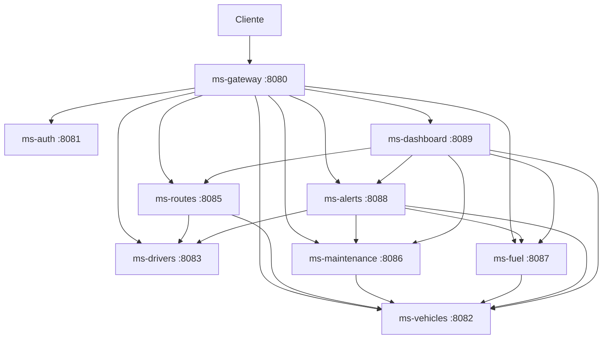

# FleetControl — Plataforma de Gestión de Flotas

Backend de gestión de flotas con arquitectura de microservicios, construido en un sprint de 2 semanas (Scrum). No depende de ninguna API externa: los datos de demostración los genera un seeder propio al arrancar.

## Arquitectura

9 microservicios que se comunican por HTTP (OpenFeign). Todos los servicios de dominio validan el JWT emitido por `ms-auth`; las llamadas entre servicios usan la cabecera `X-Internal-Key`.

| Microservicio | Puerto | Responsabilidad | Consume a |
|---|---|---|---|
| ms-gateway | 8080 | Punto de entrada, enrutamiento y rate limiting | Todos |
| ms-auth | 8081 | Registro, login y emisión de JWT | — |
| ms-vehicles | 8082 | Inventario de vehículos, estado y odómetro | — |
| ms-drivers | 8083 | Conductores, licencias y estado | — |
| ms-routes | 8085 | Planificación, ejecución e historial de rutas | ms-vehicles, ms-drivers |
| ms-maintenance | 8086 | Planes de mantenimiento y órdenes de trabajo | ms-vehicles |
| ms-fuel | 8087 | Repostajes y consumo de combustible | ms-vehicles |
| ms-alerts | 8088 | Reglas y alertas de revisión, licencia y consumo | ms-vehicles, ms-drivers, ms-maintenance, ms-fuel |
| ms-dashboard | 8089 | Resumen ejecutivo y series temporales | ms-vehicles, ms-routes, ms-fuel, ms-maintenance, ms-alerts |

### Diagrama de dependencias



## Stack

Java 17 · Spring Boot 3.x · Spring Cloud Gateway · Spring Security + JWT (HS256) · PostgreSQL 15 · Flyway · OpenFeign · Resilience4j · Caffeine · Datafaker · MapStruct · Lombok · Swagger UI / OpenAPI 3.0 · JUnit 5 + Mockito + Testcontainers · Docker Compose.

## Variables de entorno

Copia `.env.example` a `.env` (ignorado por Git) y ajusta los valores:

| Variable | Descripción |
|---|---|
| `POSTGRES_USER` | Usuario de PostgreSQL |
| `POSTGRES_PASSWORD` | Contraseña de PostgreSQL |
| `JWT_SECRET` | Secreto HS256 (mínimo 32 caracteres) |
| `INTERNAL_API_KEY` | Clave compartida para llamadas entre servicios |
| `DEMO_ADMIN_PASSWORD` | Contraseña del usuario `admin@fleetcontrol.com` |
| `SPRING_PROFILES_ACTIVE` | `demo` activa el seeder de datos |
| `DEMO_SEED` | Semilla del generador (por defecto 42) |
| `DEMO_DAYS` | Días de histórico a generar (por defecto 90) |

## Arranque

```bash
cp .env.example .env
docker compose up --build
```

- Gateway: <http://localhost:8080>
- Estado del sistema: `GET http://localhost:8080/health`
- Swagger UI de cada servicio: `http://localhost:<puerto>/swagger-ui.html`
- PostgreSQL expuesto en el puerto `5433` del host.

El seeder solo inserta datos si las tablas están vacías. Para regenerar el histórico desde cero:

```bash
docker compose down -v
docker compose up --build
```

## Estructura del repositorio

```
.github/      Configuración de GitHub (workflows, plantillas de PR)
config/       Configuración compartida
docs/         Documentación del proyecto
```

## Equipo

Equipo01.
